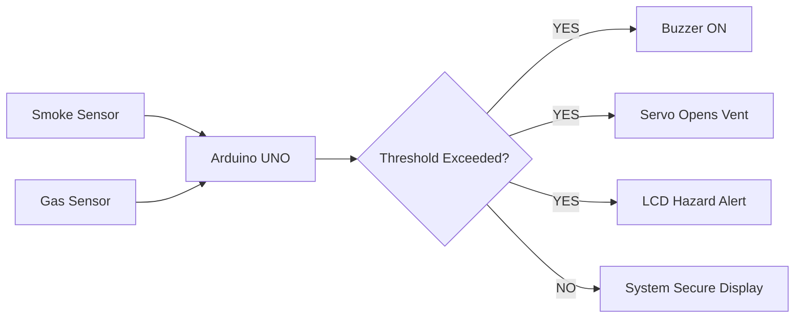

# Smart Home Security System 🚨🏠

<div align="center">


<div align="center">


</div>
</div>

---

# 📌 Overview

This project is an Arduino-based Smart Home Security System designed to detect dangerous environmental conditions such as:

* Smoke Detection
* Gas Leakage Detection
* Hazard Monitoring

The system automatically:

* Activates a buzzer alarm
* Opens a servo-controlled safety vent
* Displays live system status on an I2C LCD
* Continuously monitors sensor data in real time

---

# Features

* Real-time Smoke Detection
* Gas Leakage Monitoring
* Automatic Hazard Alert System
* Servo-Based Emergency Vent Control
* LCD Status Display
* Active/Passive Buzzer Support
* Embedded System Automation

---

# Components Used

| Component       | Quantity |
| --------------- | -------- |
| Arduino UNO     | 1        |
| MQ Smoke Sensor | 1        |
| MQ Gas Sensor   | 1        |
| I2C LCD Display | 1        |
| Servo Motor     | 1        |
| Buzzer          | 1        |
| Jumper Wires    | Multiple |
| Breadboard      | 1        |
| Power Supply    | 1        |

---

# Circuit Connections

| Component    | Arduino Pin |
| ------------ | ----------- |
| Smoke Sensor | A0          |
| Gas Sensor   | A1          |
| Servo Motor  | D9          |
| Buzzer       | D7          |
| LCD SDA      | A4          |
| LCD SCL      | A5          |

---

# System Working Process

```text
Sensors → Arduino UNO → Hazard Detection → Alarm + Servo Action + LCD Alert
```

---

# System Workflow

<div align="center">



</div>

---

# Project Preview

## 🔧 Wiring Diagram

```md
Add your generated wiring diagram here:
images/wiring-diagram.png
```

---

# Arduino Code Logic

## Hazard Detection Condition

```cpp
if (smokeValue > smokeThreshold || gasValue > gasThreshold)
```

## Alarm Activation

```cpp
if (isPassiveBuzzer) {
    tone(buzzerPin, 1000);
} else {
    digitalWrite(buzzerPin, HIGH);
}
```

## Servo Safety Vent

```cpp
safetyVentServo.write(90);
```

---

# Project Structure

```text
Smart-Home-Security-System/
│
├── smart_house_security_system.ino
├── README.md
├── .gitignore
└── images/
    └── wiring-diagram.png
```

---

# Installation Guide

## 1️⃣ Clone Repository

```bash
git clone https://github.com/yourusername/Smart-Home-Security-System.git
```

## 2️⃣ Open Arduino IDE

Install required libraries:

* Wire.h
* LiquidCrystal_I2C.h
* Servo.h

## 3️⃣ Upload Code

Upload `smart_house_security_system.ino` to Arduino UNO.

---

# LCD Output States

## Safe State

```text
SYSTEM: SECURE
S:200  G:250
```

## Hazard State

```text
!! HAZARD ALERT !!
S:450  G:600
```

---

# Future Improvements

* IoT Mobile App Integration
* Cloud Monitoring Dashboard
* GSM SMS Alert System
* WiFi Notification System

---

# Author

## OYNNDRILA SINGH PURKAYESTHA

Embedded Systems & Arduino Project

---

# Support

If you like this project:

* Star the repository
* Fork the project
* Share with others


# License

This project is licensed under the Apache-2.0 license.
